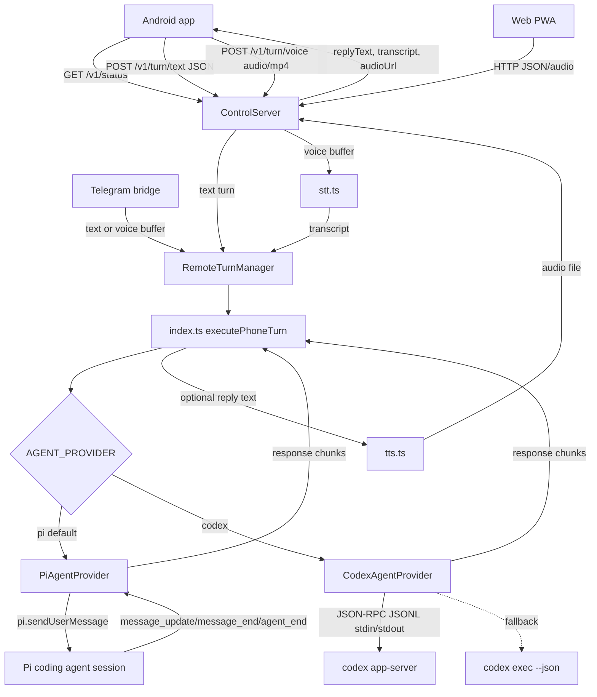

# Pi Speak Provider Integration Spec

## Status

Implemented in this repository as a provider refactor over the existing Pi Speak remote turn flow.

## Audit Summary

The existing system already had the main mobile voice loop in place:

- Android native app records AAC audio in an MPEG-4 container and uploads it as `audio/mp4`.
- Android talks to the gateway over HTTPS or local HTTP using Retrofit/OkHttp.
- The gateway is the extension-local `ControlServer` in `control-server.ts`.
- The transport is HTTP JSON plus binary audio upload, not WebSocket.
- STT is handled in `stt.ts` before an agent turn is sent.
- TTS is handled in `tts.ts` after an agent reply is captured.
- Telegram uses `phone-bridge.ts` and feeds the same remote turn queue.
- The previous hardcoded Pi agent path lived in `index.ts`: remote turns waited for an idle Pi context, optionally switched Pi sessions, called `pi.sendUserMessage()`, captured assistant output from Pi lifecycle hooks, then rendered optional TTS audio.

This refactor preserves that Pi behavior as the default `pi` provider and adds `codex` as a second provider behind the same gateway contract.

## Architecture



## Provider Interface

The shared provider contract is defined in `agent-provider.ts`.

```ts
export type AgentProviderName = "pi" | "codex";
export type AgentPromptMode = "turn" | "steer" | "followUp";

export type AgentPromptOptions = {
  mode?: AgentPromptMode;
  model?: string;
  cwd?: string;
  timeoutMs?: number;
  instructions?: string;
};

export type AgentResponseChunk = {
  type: "text";
  text: string;
};

export interface AgentProvider {
  readonly name: AgentProviderName;
  start?(): Promise<void>;
  stop?(): Promise<void>;
  sendPrompt(prompt: string, options?: AgentPromptOptions): AsyncIterable<AgentResponseChunk>;
}
```

`collectAgentResponse()` is a small adapter for existing call sites that still need a full string for TTS and HTTP responses. Providers themselves stream chunks through `AsyncIterable<AgentResponseChunk>`.

## Provider Selection

Provider config is resolved once from environment variables:

```ts
AGENT_PROVIDER=pi|codex
CODEX_BIN=codex
PI_BIN=pi
AGENT_MODEL=
```

`AGENT_PROVIDER` defaults to `pi`. Unknown values also fall back to `pi`.
For remote-turn planning, `PI_SPEAK_EXECUTION_ROUTER_MODE=auto|pi|codex` is the explicit router override. When that override is unset, an explicit `AGENT_PROVIDER=pi` or `AGENT_PROVIDER=codex` selects the execution backend so provider switching is authoritative for Android/browser/Telegram turns.

## Pi Provider

`pi-agent-provider.ts` wraps the existing Pi extension path:

- `sendPrompt()` calls `pi.sendUserMessage()`.
- If Pi emits `message_update` events, text deltas are streamed immediately.
- If no deltas were seen, the final assistant text from `message_end` is emitted as one chunk.
- `agent_end` closes the active stream.
- Existing session switching, busy checks, speech prompt injection, and TTS behavior remain in `index.ts`.

The Pi provider is a refactor of the previous path. It does not introduce a separate Pi CLI invocation.

## Codex Provider

`codex-agent-provider.ts` implements Codex behind the same interface.

Primary path:

- Spawns `CODEX_BIN app-server --listen stdio://`.
- Communicates with newline-delimited JSON-RPC messages over stdin/stdout.
- Sends `initialize`.
- Sends `thread/start` once per provider lifecycle.
- Sends `turn/start` for normal prompts.
- Streams `item/agentMessage/delta` notifications as `AgentResponseChunk` values.
- Completes the stream on `turn/completed`.
- Sends `turn/steer` when a prompt arrives in `steer` mode while a Codex turn is active.

Fallback path:

- If the app-server path cannot start before a turn is active, the provider runs `CODEX_BIN exec --json`.
- It parses JSONL stdout and emits recognized text deltas as chunks.

The adapter uses the local Codex CLI generated app-server protocol as the source of truth for method names:

- `initialize`
- `thread/start`
- `turn/start`
- `turn/steer`
- `item/agentMessage/delta`
- `turn/completed`
- `error`

## Gateway HTTP Protocol

There is no WebSocket protocol in this codebase today.

Public app routes:

```text
GET /
GET /app/
GET /app/index.html
GET /app/app.js
GET /app/app.webmanifest
GET /app/sw.js
GET /app/icon.svg
```

Status and diagnostics:

```text
GET /v1/health
GET /v1/status
GET /v1/diagnostics
GET /v1/route
POST /v1/route
```

Control routes:

```text
GET  /v1/mono/status
POST /v1/mono/on
POST /v1/mono/off

GET  /v1/speak/status
GET  /v1/speak/providers
POST /v1/speak/on
POST /v1/speak/off
POST /v1/speak/stop
POST /v1/speak/test
POST /v1/speak/provider/:provider
POST /v1/speak/rewrite/:onOrOff

GET  /v1/phone/status
POST /v1/phone/on
POST /v1/phone/off
POST /v1/phone/code
POST /v1/phone/unpair
```

Turn routes:

```text
GET  /v1/turn/text?text=hello&audio=1&target=name&cwd=/workspace/path
POST /v1/turn/text
POST /v1/turn/voice?audio=1&target=name&cwd=/workspace/path&agentProvider=codex
GET  /v1/audio/:id
```

Text request body:

```json
{
  "text": "Summarize the repo",
  "audio": true,
  "target": "optional-session-target",
  "cwd": "optional-agent-launch-directory",
  "agentProvider": "pi|codex"
}
```

`target` selects the Pi Speak session route. `cwd` selects the working directory passed to the active provider for this turn. The older `workspacePath` key is also accepted as an alias for `cwd` so clients can use a clearer UI name without changing the backend turn contract. `agentProvider` is optional. Omit it or set it to `auto` in the Android UI to follow the gateway default; set it to `pi` or `codex` to force that backend for the turn. If neither path is present, the gateway uses `AGENT_CWD`/`AGENT_WORKSPACE` when configured, otherwise the extension process directory.

Turn response body:

```json
{
  "ok": true,
  "replyText": "Assistant reply text",
  "transcript": "Voice transcript when applicable",
  "audioUrl": "/v1/audio/<id>",
  "audioMimeType": "audio/mpeg",
  "busy": false,
  "timings": {
    "queueMs": 0,
    "sttMs": 0,
    "agentWaitMs": 0,
    "agentRunMs": 0,
    "ttsMs": 0,
    "totalMs": 0
  },
  "providers": {
    "agent": "pi",
    "stt": "openai",
    "tts": "edge"
  },
  "warnings": []
}
```

## Environment Reference

Agent provider:

```text
AGENT_PROVIDER=pi|codex
CODEX_BIN=codex
PI_BIN=pi
AGENT_MODEL=
AGENT_CWD=
AGENT_WORKSPACE=
PI_SPEAK_CODEX_TIMEOUT_MS=180000
```

HTTP remote:

```text
PI_SPEAK_HTTP_HOST=0.0.0.0
PI_SPEAK_HTTP_PORT=8767
PI_SPEAK_HTTP_TOKEN=
PI_SPEAK_PUBLIC_BASE_URL=
PI_SPEAK_HTTP_AUDIO_TTL_MS=600000
PI_SPEAK_HTTP_AUDIO_CLEANUP_MS=30000
PI_SPEAK_HTTP_ALLOWED_ORIGINS=
PI_SPEAK_HTTP_TIMEOUT_MS=180000
PI_SPEAK_HTTP_TEXT_BODY_LIMIT_BYTES=65536
PI_SPEAK_HTTP_VOICE_BODY_LIMIT_BYTES=26214400
PI_SPEAK_HTTP_RATE_LIMIT_WINDOW_MS=60000
PI_SPEAK_HTTP_RATE_LIMIT_CONTROL=20
PI_SPEAK_HTTP_RATE_LIMIT_VOICE=6
PI_SPEAK_OUTBOUND_TIMEOUT_MS=30000
```

STT:

```text
PI_SPEAK_REMOTE_STT_PROVIDER=auto|local|openai
PI_SPEAK_REMOTE_WHISPER_MODEL=base
PI_SPEAK_REMOTE_OPENAI_STT_MODEL=whisper-1
PI_SPEAK_OPENAI_BASE_URL=https://api.openai.com/v1
VOICE_TOOLS_OPENAI_KEY=
OPENAI_API_KEY=
PI_SPEAK_PYTHON=
WHISPER_MODEL=tiny
WHISPER_DEVICE=cpu
WHISPER_COMPUTE=int8
```

TTS:

```text
PI_SPEAK_TTS_PROVIDER=auto|legacy|edge|openai|elevenlabs
PI_SPEAK_REWRITE_ENABLED=true|false
PI_SPEAK_OPENAI_KEY=
VOICE_TOOLS_OPENAI_KEY=
PI_SPEAK_OPENAI_TTS_MODEL=gpt-4o-mini-tts
PI_SPEAK_OPENAI_VOICE=alloy
PI_SPEAK_EDGE_VOICE=en-US-AriaNeural
PI_SPEAK_EDGE_LANG=en-US
PI_SPEAK_EDGE_RATE=1
PI_SPEAK_EDGE_TIMEOUT_MS=15000
REDACTED_ELEVENLABS_HISTORY_LINE
REDACTED_ELEVENLABS_HISTORY_LINE
REDACTED_ELEVENLABS_HISTORY_LINE
PI_SPEAK_SPEAK11_PATH=
```

Wake/listener and Telegram:

```text
PI_SPEAK_WAKE_PHRASE=PK
PI_SPEAK_MONO_ACTIVITY_TIMEOUT=15
PI_SPEAK_WAKE_SENSITIVITY=low|medium|high
PI_SPEAK_WAKE_FUZZY_ENABLED=true|false
PI_SPEAK_WAKE_FUZZY_MAX_DISTANCE=0|1|2
PI_SPEAK_WAKE_COMPACT_PREFIX_ENABLED=true|false
PI_SPEAK_TELEGRAM_BOT_TOKEN=
TELEGRAM_BOT_TOKEN=
PI_SPEAK_PHONE_WAIT_TIMEOUT_MS=180000
```

## Directory Structure

```text
agent-provider.ts          Shared provider types, config, response collection
async-queue.ts             Internal async iterator queue
pi-agent-provider.ts       Pi adapter over pi.sendUserMessage and Pi message hooks
codex-agent-provider.ts    Codex app-server adapter plus exec fallback
index.ts                   Extension composition, commands, remote turns, provider selection
control-server.ts          HTTP gateway and static mobile web app host
remote-turn-manager.ts     Remote queue, busy/backpressure handling, timing/provider metadata
stt.ts                     Remote voice transcription
tts.ts                     Speech synthesis and rewrite
phone-bridge.ts            Telegram transport
listener/listener.py       Local wake-word listener
web/remote/                Browser/PWA remote client
android-app/               Native Android client
ui/                        Ink session manager pane
```

## Changed

- Added a provider abstraction layer.
- Added Pi adapter as the default provider.
- Added Codex adapter using `codex app-server` JSON-RPC over JSONL stdin/stdout.
- Added `codex exec --json` fallback.
- Added `AGENT_PROVIDER`, `CODEX_BIN`, `PI_BIN`, `AGENT_MODEL`, `AGENT_CWD`, `AGENT_WORKSPACE`, and `PI_SPEAK_CODEX_TIMEOUT_MS` config support.
- Added optional per-turn `cwd` launch-path support to the HTTP API and Android settings.
- Added `providers.agent` metadata to remote turn responses.
- Added `SPEC.md` and `PRD.md`.

## Preserved

- Existing Android API contract remains backward compatible.
- Existing mobile web app API contract remains backward compatible.
- Telegram bridge behavior.
- STT module behavior.
- TTS module behavior.
- HTTP/Tailscale transport.
- Pi session routing, wake aliases, `/sess`, `/remote`, `/phone`, `/mono`, and `/speak` commands.
- Pi as the default provider.
