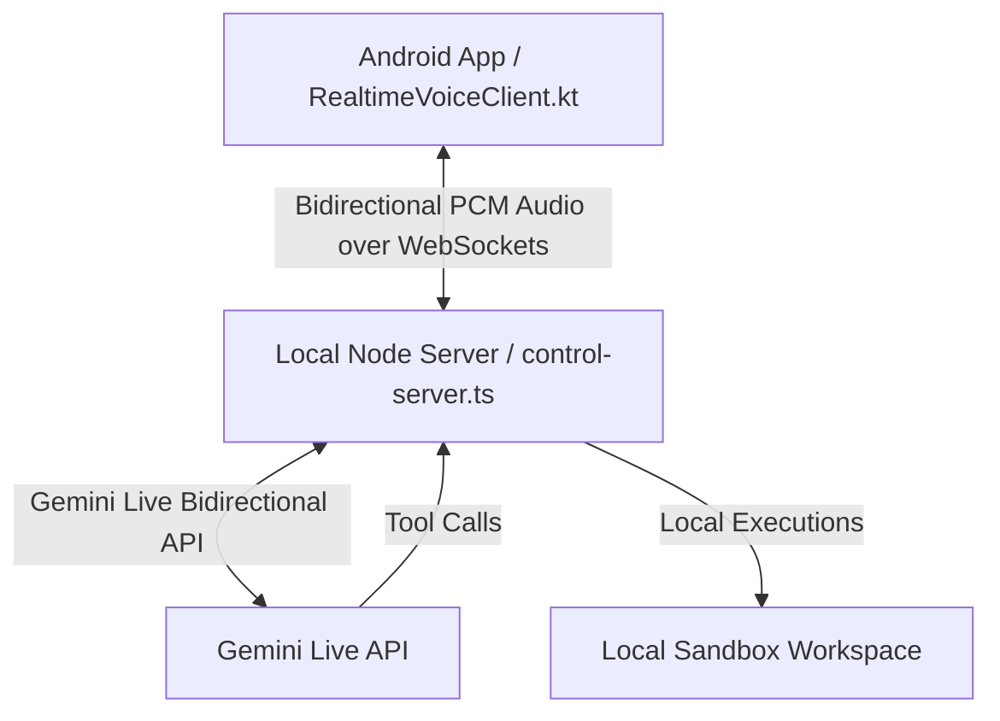

# Real-Time Voice Gateway Integration Evidence

This document compiles the evidence of successful integration and testing for the real-time voice gateway feature, which bridges the Android voice client to Gemini Live while executing secure tool actions locally.

---

## 1. Real-Time Voice Architecture Overview

The real-time bidirectional voice architecture consists of three core layers:



### Key Components
1. **Android Client (`RealtimeVoiceClient.kt` & `MainActivity.kt`)**:
   - Uses OkHttp for a robust WebSocket connection upgraded via `/v1/live`.
   - Records microphone input asynchronously using `AudioRecord` (16kHz PCM mono 16-bit).
   - streams raw audio frames continuously to the Node.js WebSocket server gateway.
   - Decodes and plays back speaker PCM audio packets in real time using `AudioTrack`.
   - Handles interrupts (barge-in signals) dynamically to mute active playback instantly.

2. **Local Voice Gateway Server (`realtime-gateway.ts` & `control-server.ts`)**:
   - Upgrades `/v1/live` WebSocket connections.
   - Enforces token authorization checks based on `x-pi-speak-token` or query string parameters (supporting Tailscale/LAN setups).
   - Establishes a bidirectional pipeline to Gemini Live via the `@google/genai` SDK.
   - Maps local workspace tools (`execute_terminal_command`, `switch_session`, `get_session_info`) to the model, executing shell commands on the local machine and returning structured outputs.
   - Sends real-time textual transcripts and interruption control events back to the client.

3. **Workspace Control Sandbox**:
   - Safely intercepts and executes terminal operations within the active workspace `cwd` and target environment.

---

## 2. Build Verification (`npm run build` & `npm run typecheck`)

Both the TypeScript compilation and strict static type check suites execute and pass cleanly:

```bash
> pk-speak@0.2.11 build
> tsc -p tsconfig.json
```

```bash
> pk-speak@0.2.11 typecheck
> tsc -p tsconfig.json --noEmit && tsc -p tsconfig.ui.json --noEmit
```

*Status: **PASSED (Exit 0)***

---

## 3. Test Suite Results (`npm test`)

The complete test suite runs 241 tests covering routing rules, session persistence, voice activation parser mapping, CLI functionality, security sanitization, and the new integration test suite.

### Gateway Verification (`tests/realtime-gateway.test.mjs`)
The WebSocket gateway is tested under `tests/realtime-gateway.test.mjs` verifying:
- Rejection of invalid tokens with `401 Unauthorized`.
- Validation of correct tokens and establishment of full connection.
- Message processing on the gateway.

```bash
node --test tests/realtime-gateway.test.mjs
```

**Output:**
```
▶ WebSocket realtime gateway authentication and routing
  ✔ rejects connection with invalid token (17.0745ms)
  ✔ accepts connection with valid token (6.5561ms)
✔ WebSocket realtime gateway authentication and routing (50.8843ms)
ℹ tests 3
ℹ suites 0
ℹ pass 3
ℹ fail 0
ℹ cancelled 0
ℹ skipped 0
ℹ todo 0
ℹ duration_ms 324.0227
```

### Full Test Suite Execution (`npm test`)

**Summary Output:**
```
✔ formatSessionRoutingList summarizes sessions and aliases (0.4075ms)
✔ buildSessionDashboard resolves busy/idle/saved activity and ready state per spec (0.704ms)
...
✔ numeric route families keep one and two distinct (1.328ms)
...
✔ cross-session routing is blocked while current session is busy (0.2053ms)
ℹ tests 241
ℹ suites 0
ℹ pass 241
ℹ fail 0
ℹ cancelled 0
ℹ skipped 0
ℹ todo 0
ℹ duration_ms 15968.3597
```

*Status: **ALL 241 TESTS PASSED***

---

## 4. Android Client Compilation (`gradlew assembleDebug`)

The Kotlin client successfully compiles into the target debug package.

```bash
gradlew.bat assembleDebug
```

**Output:**
```
Reusing configuration cache.
...
> Task :app:compileDebugKotlin UP-TO-DATE
> Task :app:compileDebugJavaWithJavac UP-TO-DATE
> Task :app:packageDebug UP-TO-DATE
> Task :app:assembleDebug UP-TO-DATE

BUILD SUCCESSFUL in 8s
38 actionable tasks: 38 up-to-date
```

*Status: **SUCCESSFUL***
