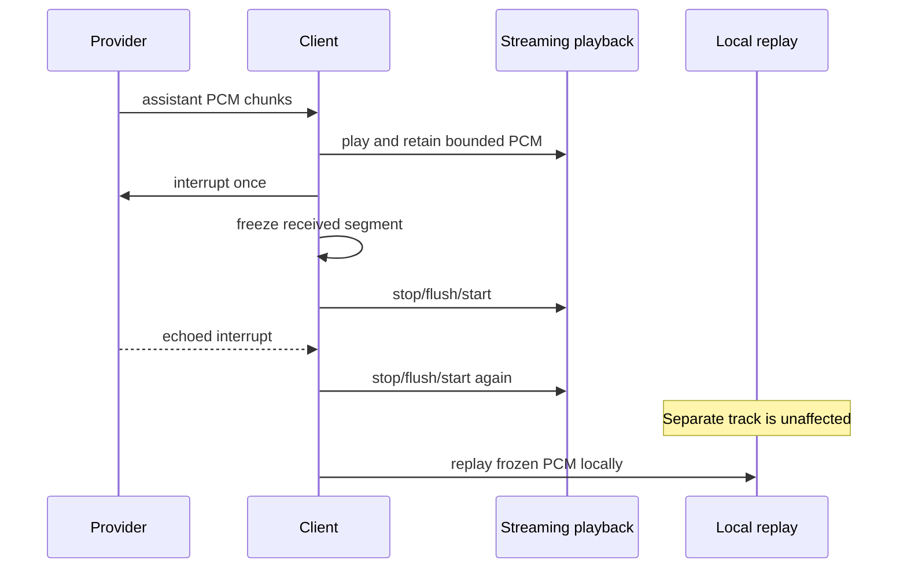

# Interrupted Assistant Audio Replay

## Scope
Client-local replay of assistant PCM interrupted by barge-in across orb, PWA, Standard Android, and Boox

## Source Evidence
- web/remote/replay-capture.js
- android-app/app/src/main/java/com/example/audio/StreamingPcmPlayer.kt

## Main Flows

Pi Speak retains a bounded copy of assistant PCM that has already arrived on a client. When a barge-in interrupts that assistant segment, the client freezes the received PCM and exposes a local **Replay** action. Replay never sends a WebSocket message, changes provider conversation state, or re-executes tools.

## Decision

Replay is strictly client-local on all supported surfaces:

- Web/PWA and orb: `web/remote/replay-capture.js` owns bounded PCM capture; `app.js` and `orb.js` enqueue the frozen samples directly into their playback worklet.
- Standard Android and Boox: `StreamingPcmPlayer` owns `InterruptedPcmBuffer`; `MainActivity.kt` and `BooxMainActivity.kt` expose Replay after a captured interrupt.
- Android streaming and replay use separate `AudioTrack` instances. A gateway-echoed interrupt may reset streamed playback without releasing an active replay track.
- `LiveAudioInterruptCoordinator` creates one segment boundary per assistant turn, suppresses duplicate local interrupt messages, and holds the turn open until the echoed interrupt so queued tail PCM cannot replace the useful replay. Each live session owns its coordinator; stale callbacks mutate only the retired session's state.
- Transcript completion is not treated as playback completion. Android snapshots the submitted-frame boundary and retains the segment until the streaming `AudioTrack` playback head drains; interrupt, stop, close, or a newer segment invalidates that completion token.
- Replay cannot start over an in-flight streaming write or queued live PCM. If accepted provider PCM arrives after replay starts, provider audio wins: Android detaches and releases the replay track before writing the frame. Duplicate/out-of-order frames are rejected before replay ownership changes.
- Session teardown cancels and releases an active replay track. Activity replay gates and availability updates require the exact active session, player, and coordinator; a transient busy/preempted replay attempt preserves the retained Replay control.

## Codebase map

| Responsibility | Files |
|---|---|
| Web PCM retention | `web/remote/replay-capture.js` |
| Orb replay UI and playback | `web/remote/orb.js`, `web/remote/orb.html`, `web/remote/orb.css` |
| PWA replay UI and playback | `web/remote/app.js`, `web/remote/index.html` |
| Android PCM retention/playback | `android-app/app/src/main/java/com/example/audio/StreamingPcmPlayer.kt` |
| Standard Android lifecycle | `android-app/app/src/main/java/com/example/MainActivity.kt` |
| Boox lifecycle | `android-app/app/src/boox/java/com/example/BooxMainActivity.kt` |
| Focused behavior tests | `tests/interrupted-audio-replay.test.mjs`, `android-app/app/src/test/java/com/example/audio/InterruptedPcmBufferTest.kt` |

## Flow

## Invariants

1. Only PCM already received by the client is replayable.
2. A completed, non-interrupted assistant turn is discarded only after queued playback drains and cannot leak into later replay.
3. Retained Android PCM is capped at 1,440,000 bytes.
4. Replay does not restore provider-side audio that was never delivered.
5. Accepted provider PCM is never suppressed: it preempts local replay before being written. Microphone upload remains suppressed only while replay is active to prevent replay echo.
6. Disconnect/error/close releases replay resources and clears session-scoped state.
7. A retired session cannot reset the active session's interrupt coordinator, replay gate, or replay availability.

## Verification

- Web replay helper: `node --test tests/interrupted-audio-replay.test.mjs` — 5 passing tests.
- Android replay state: `InterruptedPcmBufferTest` passes for Standard, including queued-tail/echo, repeated-interrupt, turn-boundary, replacement-session, and streaming-busy cases.
- Android compilation and packaging: `compileBooxDebugKotlin`, `assembleStandardDebug`, and `assembleBooxDebug` pass.
- Final adversarial lifecycle/concurrency re-audit passed after provider-preemption, transient-busy, session-ownership, and early-return ownership fixes.
- Pixel 9a deployment: installed `com.pkkidking.pispeak.dev` base APK SHA-256 matched the final Standard artifact (`6d5dd58e2a6b5c1746aac686907bc5aceacc4502fa1ad2eac6c7a29effa049a8`).
- Boox Palma deployment: installed `com.pkkidking.pispeak.dev.boox` base APK SHA-256 matched the final Boox artifact (`f68285506333fbcf32cd0956d37682aa14a38e1688fc31966aae79a88bc29a04`).

## Caveats

- [VERIFY] Physical audible replay quality, device routing, underruns, and speaker/microphone echo still require a human listening pass on Pixel 9a and Boox. Both final packages installed and launched, but the devices entered secure keyguard before the replay tap-through; build, unit, and byte-identity evidence do not prove acoustic behavior.
- [VERIFY] Section A latency campaigns in `docs/REALTIME_VOICE_PARITY_TODO.md` remain unmeasured.

## Possible Conflict

Likely conflicts detected before save:
- Review: [[pk-speak-voice-benchmarks]] (`wiki/concepts/pk-speak-voice-benchmarks.md`)
- Review: [[2026-07-14-wt001-conversational-assistant-assist]] (`wiki/sessions/2026-07-14-wt001-conversational-assistant-assist.md`)
